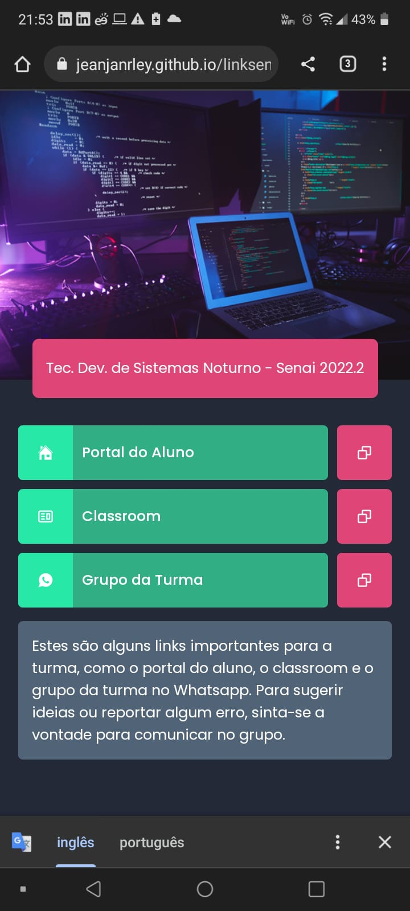
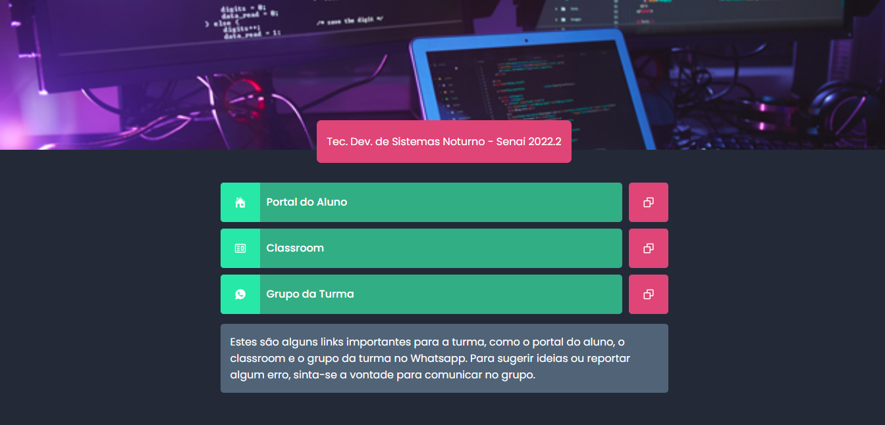

<h1>Link Senai</h1>

Turma: Dev. de sistemas 2022.2 Noturno - Camaçari-BA

##

🔴 Recentemente ingressei no curso de Tec. de Desenvolvimento de sistemas no Senai e percebi que nós estudantes, iremos fazer uso de alguns links como: Link do grupo no WhatsApp, Portal do aluno, e Classrom, até o fim do curso.

♦️ Como eu estava ansioso para testar o Vite, essa nova ferramenta que é uma alternativa ao Create React App, eu decidi que usaria a mesma para criar uma página que organizaria esses links para turma, e foi então que eu decidir criar esta página com React JS, Typescript e SASS.

A página foi criada no conceito Mobile First (Com foco primeiramente no mobile), mas é responsiva para Desktop e tablet também.

##

<a href="https://jeanjanrley.github.io/linksenai/" target="_blanc"><strong>Link da página:</strong>	https://jeanjanrley.github.io/linksenai/</a>

##

	<h1>Mobile</h1>
	
	<h1>Desktop</h1>
	

